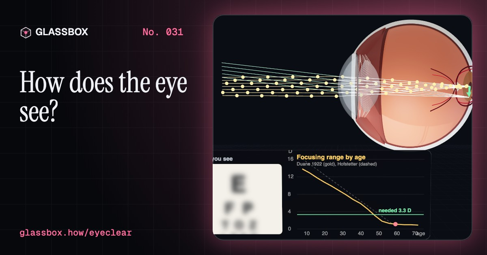
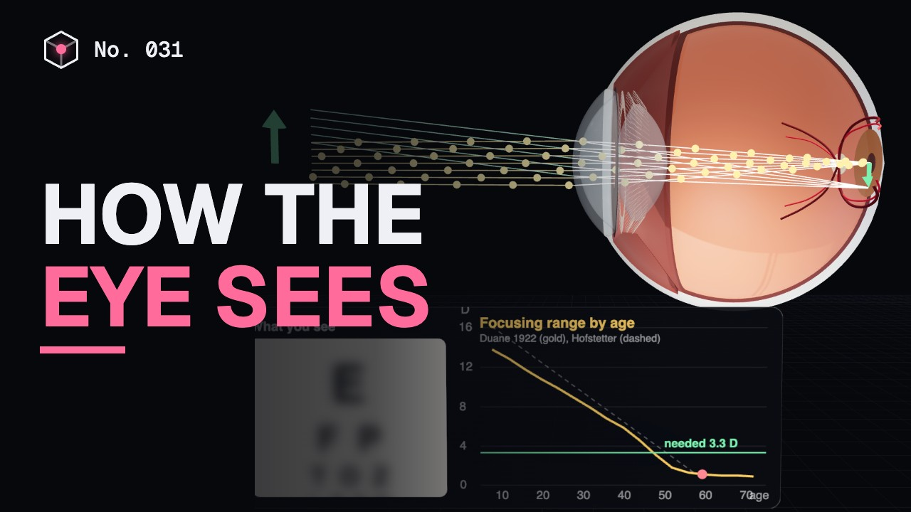
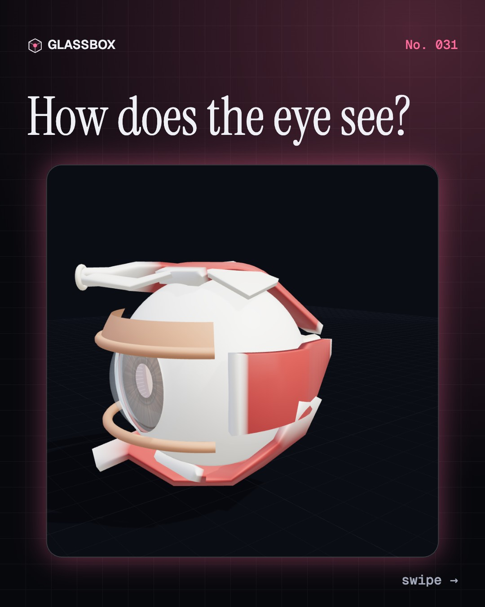
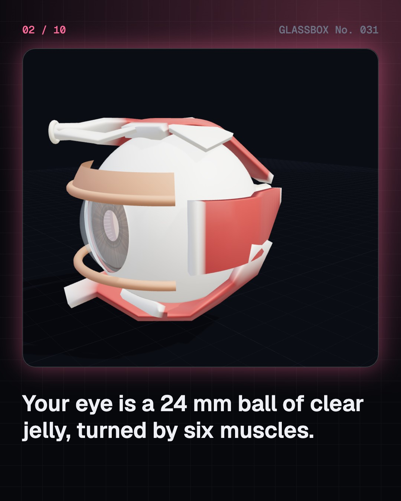
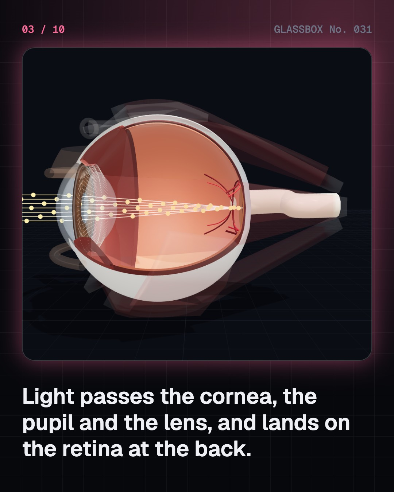
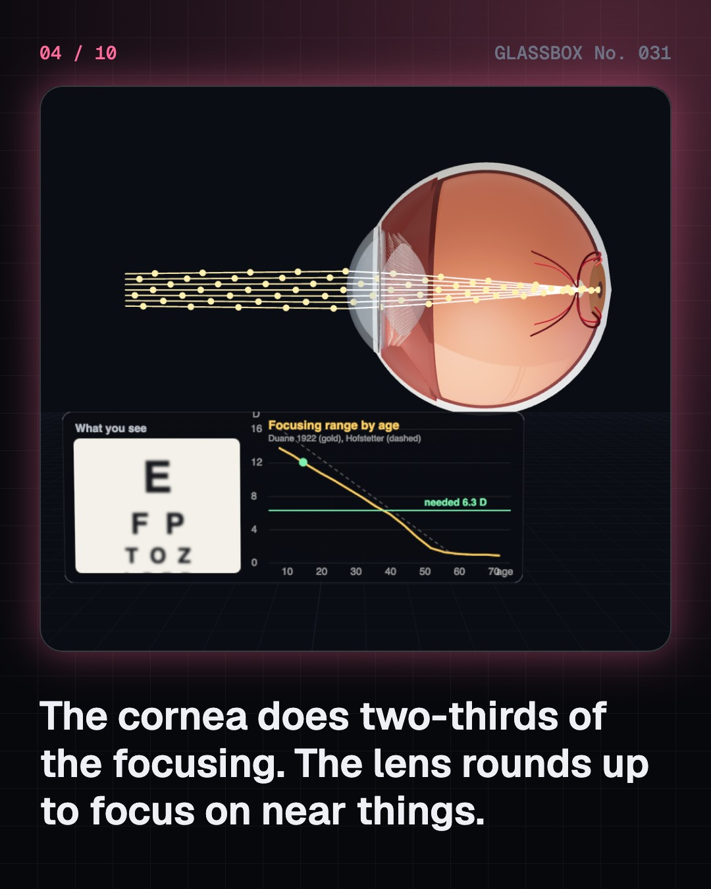

<!-- glassbox:start -->
<!-- Generated from glassbox.json by the Glassbox hub (npm run readme -- eyeclear). Edit glassbox.json, not this block. -->
<p align="center"><a href="https://glassbox-production-fd52.up.railway.app/e/eyeclear/"></a></p>

<h1 align="center">EyeClear</h1>

<p align="center"><b>How does the eye see?</b><br>Your eye is a 24 mm camera that focuses by changing the shape of a living lens, turns light into signals with 120 million rods and 6 million cones, and even has a blind spot you never notice. Trace real light rays through a 3D eye, try on glasses, and find your own blind spot.</p>

<p align="center"><a href="https://glassbox-production-fd52.up.railway.app/eyeclear/"><b>▶ Play with it</b></a> &nbsp;·&nbsp; <a href="https://glassbox-production-fd52.up.railway.app/e/eyeclear/">Read the 60-second explainer</a> &nbsp;·&nbsp; <a href="https://glassbox-production-fd52.up.railway.app/eyeclear/glassbox/reel.mp4">Watch the 40-second video</a></p>

<p align="center">
  <a href="https://glassbox-production-fd52.up.railway.app/e/eyeclear/"></a>
  <a href="https://glassbox-production-fd52.up.railway.app/e/eyeclear/"></a>
  <a href="LICENSE"></a>
  <a href="LICENSE-CONTENT.md"></a>
  <a href="#privacy"></a>
</p>

## In 60 seconds

1. **A camera made of jelly.** Light enters through the clear cornea, passes the pupil in the coloured iris, and is focused by the lens onto the retina at the back of a 24 mm ball of clear jelly. Six muscles turn the eye, and the optic nerve carries its signals to the brain.
2. **The cornea does most of the focusing.** The eye has about 60 dioptres of focusing power. The fixed, curved cornea gives about 42 of them; the lens adds about 20 and does the adjusting. To see near things the ciliary muscle contracts, the zonules slacken and the lens rounds up. The picture on the retina is upside down.
3. **Why we need reading glasses.** The lens stiffens with age. A child can focus about 14 dioptres closer, a 45-year-old about 4 and a 60-year-old about 1, so the near point moves past arm's length in the 40s. This presbyopia happens to everyone.
4. **A millimetre too long.** In short sight the eyeball is usually too long, so distant light focuses in front of the retina; each extra millimetre is roughly 3 dioptres. A concave lens fixes it, a convex lens fixes long sight. About half the world may be short-sighted by 2050.
5. **Rods, cones and the blind spot.** About 120 million rods see in dim light but not in colour; about 6 million cones, packed into the fovea, give colour and detail. A photon changes the shape of retinal in rhodopsin to start the signal. Where the optic nerve leaves there are no receptors at all: the blind spot.
6. **Three cones make every colour.** S, M and L cones peak near 420, 530 and 560 nm, and the brain reads colour from the pattern of their signals. Red plus green light can excite them exactly like yellow light, which is how screens work. About 8% of men of Northern European ancestry have red-green colour vision deficiency.
7. **Keeping eyes healthy.** Cataract, a clouded lens, is the leading cause of blindness worldwide and in India, and surgery replaces it with a clear plastic lens. Glaucoma quietly damages the optic nerve and diabetes can damage the retina, so regular eye checks matter. For your own eyes, see an eye doctor.

## Words worth knowing

| Term | Meaning |
|---|---|
| **Cornea** | The clear dome at the front of the eye, which does about two-thirds of the focusing. |
| **Lens and accommodation** | The flexible lens behind the pupil changes shape to focus on near things; this is accommodation. |
| **Dioptre** | A unit of focusing power: 1 divided by the focal length in metres. The whole eye has about 60. |
| **Retina** | The light-sensing layer lining the back of the eye, with rods, cones and nerve cells. |
| **Fovea** | A tiny pit in the macula, packed with cones, where vision is sharpest. |
| **Rods and cones** | Rods see in dim light without colour; three kinds of cone see colour and detail in good light. |
| **Blind spot** | The optic disc, where the optic nerve leaves the eye and there are no rods or cones. |
| **Myopia** | Short sight: distant things blur because light focuses in front of the retina, usually because the eye is too long. |
| **Presbyopia** | The loss of near focusing with age as the lens stiffens, usually noticed in the 40s. |

## A short history

**2,600 years from pushing a cloudy lens aside with a needle to lasers, plastic lenses and a billion people still waiting for glasses.**

- **1011** · Light comes into the eye (Ibn al-Haytham (Alhazen), Cairo)
- **1286** · Glasses for reading (Unknown craftsmen, Pisa, Italy)
- **1604** · A picture on the retina, upside down (Johannes Kepler, Prague)
- **1794** · A scientist describes his own colour blindness (John Dalton, Manchester)
- **1802** · Three kinds of receptor (Thomas Young, London)
- **1851** · Seeing inside a living eye (Hermann von Helmholtz, Königsberg)
- **1862** · The eye chart (Herman Snellen, Utrecht)
- **1949** · A plastic lens inside the eye (Harold Ridley, St Thomas' Hospital, London)

The full story, with 28 moments, charts, people and 51 sources: [glassbox.how/e/eyeclear/history](https://glassbox-production-fd52.up.railway.app/e/eyeclear/history/). The data lives in [`history.json`](history.json).

## Video and slides

Made with the Glassbox studio from this box's storyboard (`window.glassbox.director`). Free to reuse under CC BY 4.0.

<a href="https://glassbox-production-fd52.up.railway.app/eyeclear/glassbox/video.mp4"></a>

<p><a href="glassbox/slide-1.jpg"></a> <a href="glassbox/slide-2.jpg"></a> <a href="glassbox/slide-3.jpg"></a> <a href="glassbox/slide-4.jpg"></a></p>

| File | What | Size |
|---|---|---|
| [`glassbox/reel.mp4`](https://glassbox-production-fd52.up.railway.app/eyeclear/glassbox/reel.mp4) | Reel / Short, with captions and soundtrack | 1080×1920 |
| [`glassbox/video.mp4`](https://glassbox-production-fd52.up.railway.app/eyeclear/glassbox/video.mp4) | YouTube video, with captions and soundtrack | 1920×1080 |
| `glassbox/slide-1…10.jpg` | Instagram carousel | 1080×1350 |
| `glassbox/thumb.jpg` | YouTube thumbnail | 1280×720 |
| `glassbox/cover.jpg` | Share card and repo social preview | 1200×630 |
| [`glassbox/history-reel.mp4`](https://glassbox-production-fd52.up.railway.app/eyeclear/glassbox/history-reel.mp4) | “History in 10 moments” Reel / Short | 1080×1920 |
| `glassbox/history-slide-*.jpg` | History carousel | 1080×1350 |
| `glassbox/post.json` | Post copy and schedule used by the publish kit | |

## Privacy

This box has no accounts and no ads, and it ships its own fonts and libraries. When you run it yourself it sends nothing anywhere. On glassbox.how, the site's `/bar.js` also loads Glassbox's analytics: **Google Analytics** to count visits (it asks first in the EU, UK and Switzerland, and stays off when your browser sends Global Privacy Control or Do Not Track) and **ClickTrust** to detect bots.

It remembers a few things **in your own browser only**, and never sends them anywhere:

| Browser storage key | What it holds |
|---|---|
| `eyeclear.v1` | Which chapters you have opened, your best quiz scores, and sound on or off. |

Exactly what each one sees is at [glassbox.how/privacy](https://glassbox-production-fd52.up.railway.app/privacy/).

## Licences

- **Code:** [MIT](LICENSE). Use it, change it, ship it.
- **Explanations, text, images and videos** (`glassbox.json`, `glassbox/`): [CC BY 4.0](LICENSE-CONTENT.md). Credit “Glassbox, glassbox.how/e/eyeclear”.
- **Third-party parts** keep their own licences: [three.js](https://threejs.org) (MIT), [Geist, Instrument Serif](https://openfontlicense.org) (SIL OFL 1.1).
- The Glassbox name and logo aren't covered by either licence. See the [terms](https://glassbox-production-fd52.up.railway.app/terms/).

Found a mistake? [Open an issue](https://github.com/bdeeps/eyeclear/issues). Corrections happen in public.
<!-- glassbox:end -->

## Run it

It's plain HTML, CSS and JavaScript. No build step and no dependencies. Run locally, it contacts no other website.

```bash
python3 -m http.server 8000
```

Three.js and the fonts ship in `vendor/` and `fonts/`, so it also works offline.

Then open http://localhost:8000.

## How it's built

| File | What |
|---|---|
| `index.html`, `css/app.css` | The page and its styles |
| `js/app.js`, `js/stage.js`, `js/ui.js`, `js/kit.js` | The shared Glassbox 3D engine: chapters, 3D stage, controls, quiz, video director |
| `js/chapters/*.js` | One file per chapter: the 3D model, controls, text, key terms, quiz and video scenes |
| `js/eye.js` | The 3D eye (built in millimetres: cornea, iris, lens and zonules, ciliary body, three-layer wall, macula, optic disc, vessels, six muscles, eyelids), light rays, boards and helpers |
| `js/optics.js` | The maths: Le Grand's schematic eye with exact ray tracing, accommodation and presbyopia (Duane), glasses, rod and cone densities, dark adaptation, cone sensitivity curves and colour-blindness simulation |
| `glassbox.json` | Title, question, explainer beats, key terms, browser storage and credits shown on glassbox.how |
| `reel` in each chapter | The storyboard the Glassbox studio records into short videos |
| `glassbox/` | The published video, slides, thumbnail and post copy |
| `fonts/`, `vendor/three/` | Self-hosted Geist and Instrument Serif (SIL OFL 1.1) and three.js (MIT) |
